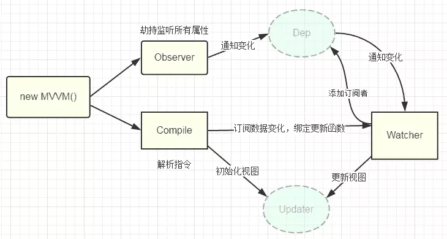

# Vue数据双向绑定原理


## 1、数据绑定原理简介
&emsp;&emsp;在正式开始之前我们先来说说数据绑定的事情，数据绑定我的理解就是让数据M（model）展示到 视图V（view）上。我们常见的架构模式有 MVC、MVP、MVVM模式，目前前端框架基本上都是采用 MVVM 模式实现双向绑定，Vue 自然也不例外。但是各个框架实现双向绑定的方法略有所不同，目前大概有三种实现方式。

* 发布订阅模式
* Angular 的脏查机制
* 数据劫持

&emsp;&emsp;而 Vue 则采用的是数据劫持与发布订阅相结合的方式实现双向绑定，数据劫持主要通过Object.defineProperty 来实现。


## 2、Vue双向绑定原理图




## 3、数据劫持原理 Object.defineProperty

 ```javascript
         var people = {
            name: "Modeng",
            age: 18
        }
        people.age; //18
        people.age = 20;
        上述代码就是普通的获取/设置对象的属性，看不到什么奇怪的变化。
        
        var modeng = {}
        var age;
        Object.defineProperty(modeng, 'age', {
          get: function () {
            console.log("获取年龄");
            return age;
          },
          set: function (newVal) {
            console.log("设置年龄");
            age = newVal;
          }
        });
        modeng.age = 18;
        console.log(modeng.age);
```

&emsp;&emsp;获取 age 属性时会自动执行 get 函数，设置 age 属性时，会自动执行 set  函数，这就给我们的双向绑定提供了非常大的方便。

## 4、Vue双向绑定原理步骤分解

&emsp;&emsp; Vue 是通过数据劫持结合发布订阅模式来实现双向绑定的。数据劫持是通过 Object.defineProperty 方法，当我们知道这些之后，我们就需要一个监听器 Observer 来监听属性的变化。得知属性发生变化之后我们需要一个 Watcher 订阅者来更新视图，我们还需要一个 compile 指令解析器，用于解析我们的节点元素的指令与初始化视图。
 

> ### (1)监听器Observer：用来监听属性的变化通知订阅者

&emsp;&emsp;监听器的作用就是去监听数据的每一个属性，我们上面也说了使用 Object.defineProperty 方法，当我们监听到属性发生变化之后我们需要通知 Watcher 订阅者执行更新函数去更新视图，在这个过程中我们可能会有很多个订阅者 Watcher 所以我们要创建一个容器 Dep 去做一个统一的管理。
 
 ```javascript
         function defineReactive(data, key, value) {
          //递归调用，监听所有属性
          observer(value);
          var dep = new Dep();
          Object.defineProperty(data, key, {
            get: function () {
              if (Dep.target) {
                dep.addSub(Dep.target);
              }
              return value;
            },
            set: function (newVal) {
              if (value !== newVal) {
                value = newVal;
                dep.notify(); //通知订阅器
              }
            }
          });
        }
        
        function observer(data) {
          if (!data || typeof data !== "object") {
            return;
          }
          Object.keys(data).forEach(key => {
            defineReactive(data, key, data[key]);
          });
        }
        
        function Dep() {
          this.subs = [];
        }
        Dep.prototype.addSub = function (sub) {
          this.subs.push(sub);
        }
        Dep.prototype.notify = function () {
          console.log('属性变化通知 Watcher 执行更新视图函数');
          this.subs.forEach(sub => {
            sub.update();
          })
        }
        Dep.target = null;
 ```
 
 &emsp;&emsp;以上我们就创建了一个监听器 Observer，我们现在可以尝试一下给一个对象添加监听然后改变属性会有何变化。
 
 ```javascript
         var modeng = {
          age: 18
        }
        observer(modeng);
        modeng.age = 20;
 ```
&emsp;&emsp;我们可以看到浏览器控制台打印出 “属性变化通知 Watcher 执行更新视图函数” 说明我们实现的监听器没毛病，既然监听器有了，我们就可以通知属性变化了，那肯定是需要 Watcher 的时候了。
 
> ### (2)订阅者Watcher：收到属性的变化，然后更新视图

&emsp;&emsp;Watcher 主要是接受属性变化的通知，然后去执行更新函数去更新视图，所以我们做的主要是有两步：

* 把 Watcher 添加到 Dep 容器中，这里我们用到了 监听器的 get 函数
* 接收到通知，执行更新函数。

```javascript
        function Watcher(vm, prop, callback) {
          this.vm = vm;
          this.prop = prop;
          this.callback = callback;
          this.value = this.get();
        }
        Watcher.prototype = {
          update: function () {
            const value = this.vm.$data[this.prop];
            const oldVal = this.value;
            if (value !== oldVal) {
              this.value = value;
              this.callback(value);
            }
          },
          get: function () {
            Dep.target = this; //储存订阅器
            const value = this.vm.$data[this.prop]; //因为属性被监听，这一步会执行监听器里的 get方法
            Dep.target = null;
            return value;
          }
        }
```

&emsp;&emsp;这一步我们把 Watcher 也给弄了出来，到这一步我们已经实现了一个简单的双向绑定了，我们可以尝试把两者结合起来看下效果。

```javascript
        function Mvue(options, prop) {
            this.$options = options;
            this.$data = options.data;
            this.$prop = prop;
            this.$el = document.querySelector(options.el);
            this.init();
        }
        Mvue.prototype.init = function () {
            observer(this.$data);
            this.$el.textContent = this.$data[this.$prop];
            new Watcher(this, this.$prop, value => {
                this.$el.textContent = value;
            });
        }
```

&emsp;&emsp;这里我们尝试利用一个实例来把数据与需要监听的属性传递进来，通过监听器监听数据，然后添加属性订阅，绑定更新函数。

```javascript
        <div id="app">{{name}}</div>
        const vm = new Mvue({
            el: "#app",
            data: {
                name: "我是摩登"
            }
        }, "name");
```

&emsp;&emsp;到这一步我们我们基本上已经实现了一个简单的双向绑定，但是不难发现我们这里的属性都是写死的，也没有指令模板的解析，所以下一步我们来实现一个模板解析器。

> ### (3)解析器Compile：解析指令，初始化模版，绑定订阅者

&emsp;&emsp;Compile 的主要作用一个是用来解析指令初始化模板，一个是用来添加添加订阅者，绑定更新函数。因为在解析 DOM 节点的过程中我们会频繁的操作 DOM， 所以我们利用文档片段（DocumentFragment）来帮助我们去解析 DOM 优化性能。

```javascript
         function Compile(vm) {
          this.vm = vm;
          this.el = vm.$el;
          this.fragment = null;
          this.init();
        }
        Compile.prototype = {
          init: function () {
            this.fragment = this.nodeFragment(this.el);
          },
          nodeFragment: function (el) {
            const fragment = document.createDocumentFragment();
            let child = el.firstChild;
            //将子节点，全部移动文档片段里
            while (child) {
              fragment.appendChild(child);
              child = el.firstChild;
            }
            return fragment;
          }
        }
```

&emsp;&emsp;然后我们就需要对整个节点和指令进行处理编译，根据不同的节点去调用不同的渲染函数，绑定更新函数，编译完成之后，再把 DOM 片段添加到页面中。

```javascript
         Compile.prototype = {
          compileNode: function (fragment) {
            let childNodes = fragment.childNodes;
            [...childNodes].forEach(node => {
              let reg = /\{\{(.*)\}\}/;
              let text = node.textContent;
              if (this.isElementNode(node)) {
                this.compile(node); //渲染指令模板
              } else if (this.isTextNode(node) && reg.test(text)) {
                let prop = RegExp.$1;
                this.compileText(node, prop); //渲染{{}} 模板
              }
        
              //递归编译子节点
              if (node.childNodes && node.childNodes.length) {
                this.compileNode(node);
              }
            });
          },
          compile: function (node) {
            let nodeAttrs = node.attributes;
            [...nodeAttrs].forEach(attr => {
              let name = attr.name;
              if (this.isDirective(name)) {
                let value = attr.value;
                if (name === "v-model") {
                  this.compileModel(node, value);
                }
                node.removeAttribute(name);
              }
            });
          },
          //省略。。。
        }
```

&emsp;&emsp;到这里我们的整个的模板编译也已经完成，不过这里我们并没有实现过多的指令，我们只是简单的实现了 v-model 指令，本意是通过这篇文章让大家熟悉与认识 Vue 的双向绑定原理，并不是去创造一个新的 MVVM 实例。所以并没有考虑很多细节与设计。

&emsp;&emsp;现在我们实现了 Observer、Watcher、Compile，接下来就是把三者给组织起来，成为一个完整的 MVVM。

> ### (4)创建Vue

&emsp;&emsp;这里我们创建一个 Mvue 的类（构造函数）用来承载 Observer、Watcher、Compile 三者。

```javascript
         function Mvue(options) {
          this.$options = options;
          this.$data = options.data;
          this.$el = document.querySelector(options.el);
          this.init();
        }
        Mvue.prototype.init = function () {
          observer(this.$data);
          new Compile(this);
        }
```

&emsp;&emsp;然后我们就去测试一下结果，看看我们实现的 Mvue 是不是真的可以运行。

```javascript
        <div id="app">
            <h1>{{name}}</h1>
        </div>
        <script src="./js/observer.js"></script>
        <script src="./js/watcher.js"></script>
        <script src="./js/compile.js"></script>
        <script src="./js/index.js"></script>
        <script>
            const vm = new Mvue({
                el: "#app",
                data: {
                    name: "完全没问题，看起来是不是很酷！"
                }
            });
        </script>
```
> ### (5)数据代理

&emsp;&emsp;我们来改造下 Mvue 添加数据代理功能，我们也是利用 Object.defineProperty 方法进行一步中间的转换操作，间接的去访问。

```javascript
         function Mvue(options) {
          this.$options = options;
          this.$data = options.data;
          this.$el = document.querySelector(options.el);
          //数据代理
          Object.keys(this.$data).forEach(key => {
            this.proxyData(key);
          });
        
          this.init();
        }
        Mvue.prototype.init = function () {
          observer(this.$data);
          new Compile(this);
        }
        Mvue.prototype.proxyData = function (key) {
          Object.defineProperty(this, key, {
            get: function () {
              return this.$data[key]
            },
            set: function (value) {
              this.$data[key] = value;
            }
          });
        }
```

## 5、相关链接
[Vue双向绑定原理，教你一步一步实现双向绑定](https://www.cnblogs.com/beevesnoodles/p/9844854.html)
